# 🌙 Moonlight Café — Manual de Usuario

> **Versión:** 1.0 · **Fecha:** Junio 2026  
> **Plataforma:** Aplicación Web (React + Vite)  
> **Soporte:** moonlight@gmail.com.pe

---

## Índice de Contenidos

1. [Introducción](#1-introducción)
2. [Requisitos del sistema](#2-requisitos-del-sistema)
3. [Acceso a la aplicación](#3-acceso-a-la-aplicación)
4. [Página de Inicio](#4-página-de-inicio)
   - 4.1 [Sección Hero](#41-sección-hero)
   - 4.2 [Productos Destacados](#42-productos-destacados)
   - 4.3 [Sección "Por qué Moonlight"](#43-sección-por-qué-moonlight)
5. [Catálogo / Menú](#5-catálogo--menú)
   - 5.1 [Ver todos los productos](#51-ver-todos-los-productos)
   - 5.2 [Filtrar por categoría](#52-filtrar-por-categoría)
   - 5.3 [Buscar productos](#53-buscar-productos)
   - 5.4 [Seleccionar tamaño y agregar al carrito](#54-seleccionar-tamaño-y-agregar-al-carrito)
6. [Mi Cuenta — Registro e Inicio de Sesión](#6-mi-cuenta--registro-e-inicio-de-sesión)
   - 6.1 [Iniciar Sesión](#61-iniciar-sesión)
   - 6.2 [Registrarse](#62-registrarse)
   - 6.3 [Errores de validación](#63-errores-de-validación)
   - 6.4 [Menú de usuario (sesión activa)](#64-menú-de-usuario-sesión-activa)
   - 6.5 [Cerrar Sesión](#65-cerrar-sesión)
7. [Carrito de Compras](#7-carrito-de-compras)
   - 7.1 [Abrir el carrito](#71-abrir-el-carrito)
   - 7.2 [Modificar cantidades](#72-modificar-cantidades)
   - 7.3 [Eliminar productos](#73-eliminar-productos)
   - 7.4 [Vaciar el carrito](#74-vaciar-el-carrito)
   - 7.5 [Confirmar pedido](#75-confirmar-pedido)
   - 7.6 [Carrito vacío](#76-carrito-vacío)
8. [Mis Pedidos](#8-mis-pedidos)
   - 8.1 [Ver historial de pedidos](#81-ver-historial-de-pedidos)
   - 8.2 [Estados de un pedido](#82-estados-de-un-pedido)
9. [Notificaciones (Toast)](#9-notificaciones-toast)
10. [Página no encontrada (404)](#10-página-no-encontrada-404)
11. [Navegación general (Navbar)](#11-navegación-general-navbar)
12. [Preguntas Frecuentes (FAQ)](#12-preguntas-frecuentes-faq)

---

## 1. Introducción

**Moonlight Café** es una aplicación web de pedidos en línea para la cafetería artesanal Moonlight, ubicada en Arequipa, Perú. Permite a los clientes explorar el menú, agregar bebidas al carrito, y confirmar pedidos directamente desde el navegador.

**Funcionalidades principales:**

| Función | Disponible sin sesión | Requiere cuenta |
|---|:---:|:---:|
| Ver el menú completo | ✅ | — |
| Filtrar y buscar productos | ✅ | — |
| Agregar al carrito | ✅ | — |
| Confirmar un pedido | — | ✅ |
| Ver historial de pedidos | — | ✅ |

---

## 2. Requisitos del sistema

| Elemento | Requisito mínimo |
|---|---|
| **Navegador** | Chrome 90+, Firefox 88+, Safari 14+, Edge 90+ |
| **Conexión** | Internet (para cargar el catálogo) |
| **Resolución** | 360 px de ancho en adelante (responsive) |
| **JavaScript** | Debe estar habilitado |

No se requiere instalar ninguna aplicación adicional.

---

## 3. Acceso a la aplicación

Abre tu navegador web e ingresa la URL proporcionada por Moonlight Café. La aplicación carga automáticamente en la **Página de Inicio**.

> **Consejo:** Puedes guardar la dirección como favorito para acceder rápidamente en el futuro.

---

## 4. Página de Inicio

La página de inicio es la puerta de entrada a toda la experiencia Moonlight. Presenta el concepto del café y permite navegar al menú de forma rápida.

### 4.1 Sección Hero

Al ingresar verás la sección principal con el nombre de la cafetería y dos botones de acción.

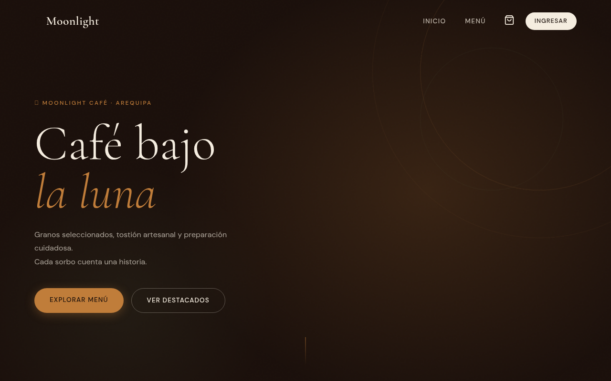

| Elemento | Descripción |
|---|---|
| **"Explorar Menú"** | Lleva directamente al catálogo de productos |
| **"Ver Destacados"** | Desplaza la página hacia los productos recomendados |

### 4.2 Productos Destacados

Debajo del hero encontrarás una selección de los productos más populares del día.

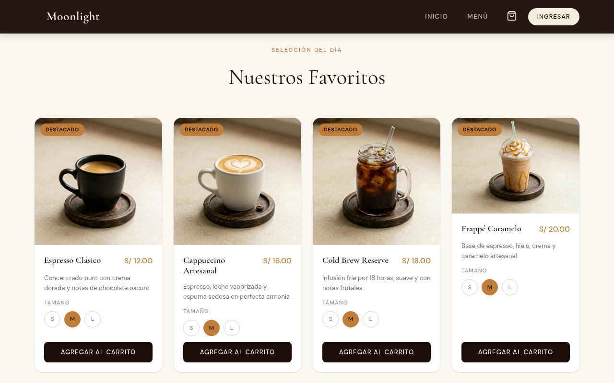

- Se muestran hasta **4 productos destacados**.
- Cada tarjeta tiene imagen, nombre, precio y botón para agregar al carrito.
- El enlace **"Ver menú completo →"** navega al catálogo completo.

> **Carga de contenido:** Mientras los productos se obtienen del servidor, aparecen tarjetas con animación de carga (*skeleton*). Esto es normal y dura solo un instante.

### 4.3 Sección "Por qué Moonlight"

Al bajar más encontrarás los pilares de la cafetería.

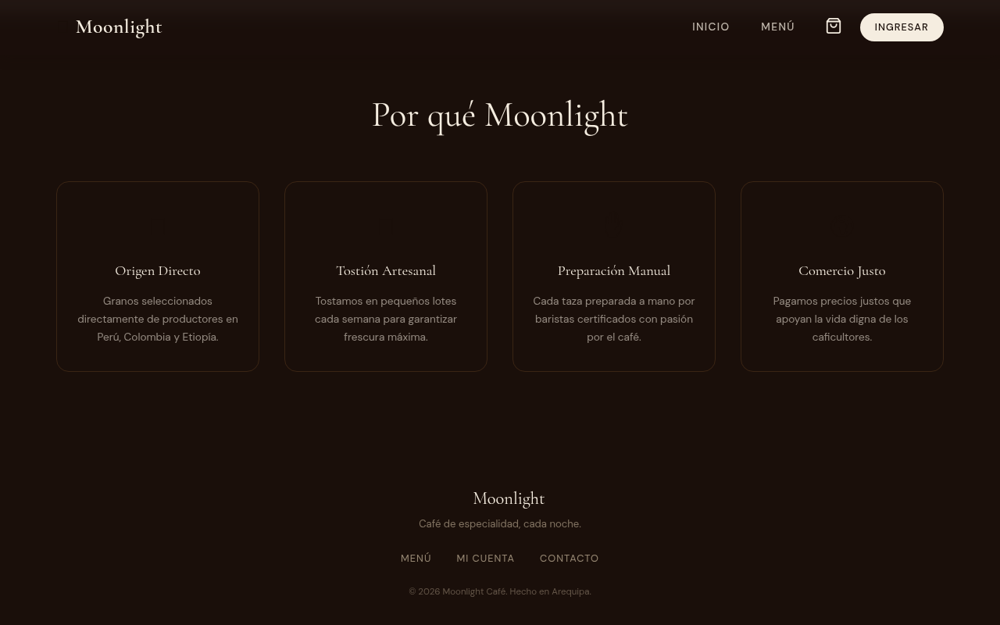

| Valor | Significado |
|---|---|
| 🌱 **Origen Directo** | Granos seleccionados de Perú, Colombia y Etiopía |
| 🔥 **Tostión Artesanal** | Pequeños lotes frescos cada semana |
| ✋ **Preparación Manual** | Baristas certificados en cada taza |
| 🌍 **Comercio Justo** | Precios justos para los caficultores |

---

## 5. Catálogo / Menú

Accede al catálogo desde la barra de navegación (**Menú**) o desde los botones de la página de inicio.

### 5.1 Ver todos los productos

El catálogo muestra la colección completa de bebidas disponibles.

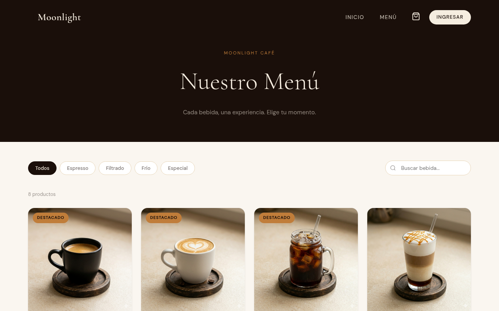

- El contador en la parte superior indica cuántos productos se están mostrando.
- Las tarjetas con la etiqueta **"Destacado"** son las recomendaciones del día.

### 5.2 Filtrar por categoría

Usa los botones de categoría debajo del título para filtrar el menú.

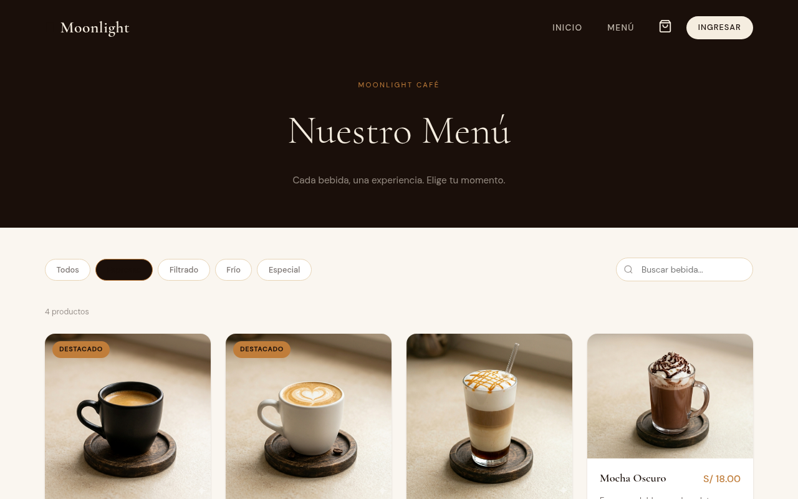

| Categoría | Qué incluye |
|---|---|
| **Todos** | El menú completo (vista por defecto) |
| **Espresso** | Espresso Clásico, Cappuccino, Latte de Vainilla, Mocha Oscuro |
| **Filtrado** | Café de Altura y otras preparaciones por goteo |
| **Frío** | Cold Brew Reserve, Frappé Caramelo |
| **Especial** | Matcha Latte y otras opciones únicas |

Al hacer clic en una categoría, el botón queda resaltado en oscuro para indicar la selección activa.

### 5.3 Buscar productos

El campo de búsqueda en la esquina superior derecha filtra por nombre o descripción en tiempo real.

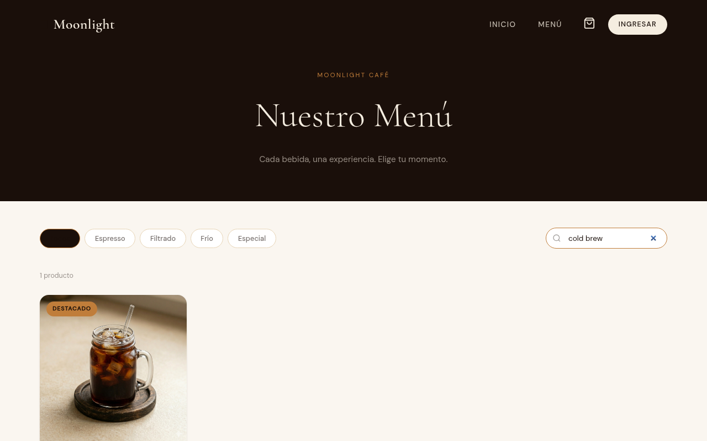

**Pasos para buscar:**
1. Haz clic en el campo **"Buscar bebida..."**
2. Escribe el nombre o una palabra clave (p. ej., *cold*, *matcha*, *caramelo*)
3. Los resultados se actualizan automáticamente mientras escribes

Si ningún producto coincide con la búsqueda, aparece el siguiente mensaje:

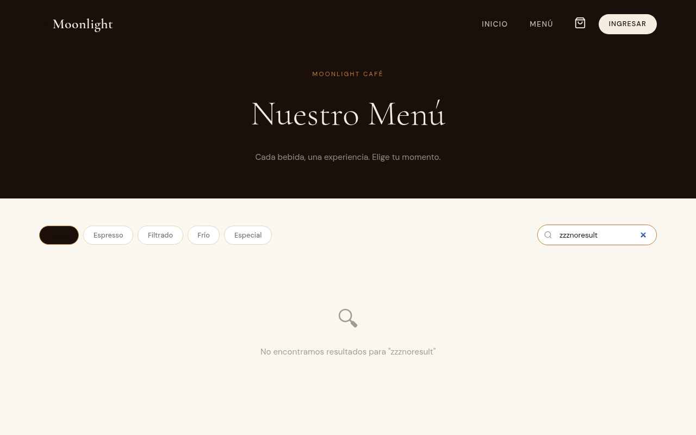

> **Consejo:** Borra el texto del campo de búsqueda para volver a ver todos los productos.

### 5.4 Seleccionar tamaño y agregar al carrito

Cada tarjeta de producto permite elegir el tamaño antes de agregar.

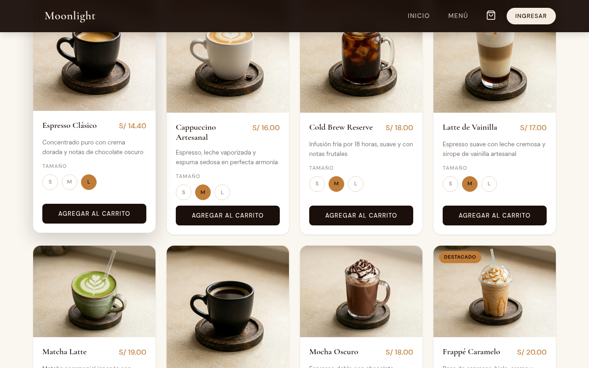

**Tamaños disponibles:**

| Tamaño | Código | Efecto en precio |
|---|:---:|:---:|
| Pequeño | **S** | −15 % del precio base |
| Mediano | **M** | Precio base (seleccionado por defecto) |
| Grande | **L** | +20 % del precio base |

**Para agregar un producto:**
1. Selecciona el tamaño deseado (S, M o L)
2. Verifica el precio actualizado que aparece en la tarjeta
3. Haz clic en **"Agregar al carrito"**

El botón muestra brevemente **"¡Agregado! ✓"** y el carrito se abre automáticamente:

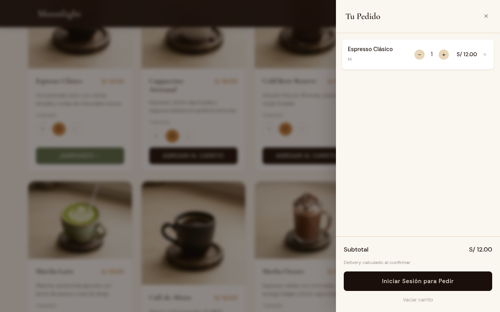

> **Nota:** Si un producto aparece como **"No disponible"**, el botón estará deshabilitado y no podrá añadirse al carrito.

---

## 6. Mi Cuenta — Registro e Inicio de Sesión

Para confirmar pedidos y ver tu historial necesitas una cuenta Moonlight.

### 6.1 Iniciar Sesión

Haz clic en **"Ingresar"** en la barra de navegación.

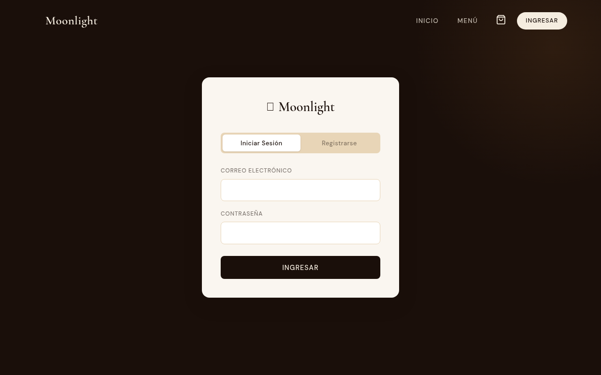

**Pasos:**
1. Ingresa tu **correo electrónico** registrado
2. Ingresa tu **contraseña** (mínimo 8 caracteres)
3. Haz clic en **"Ingresar"**

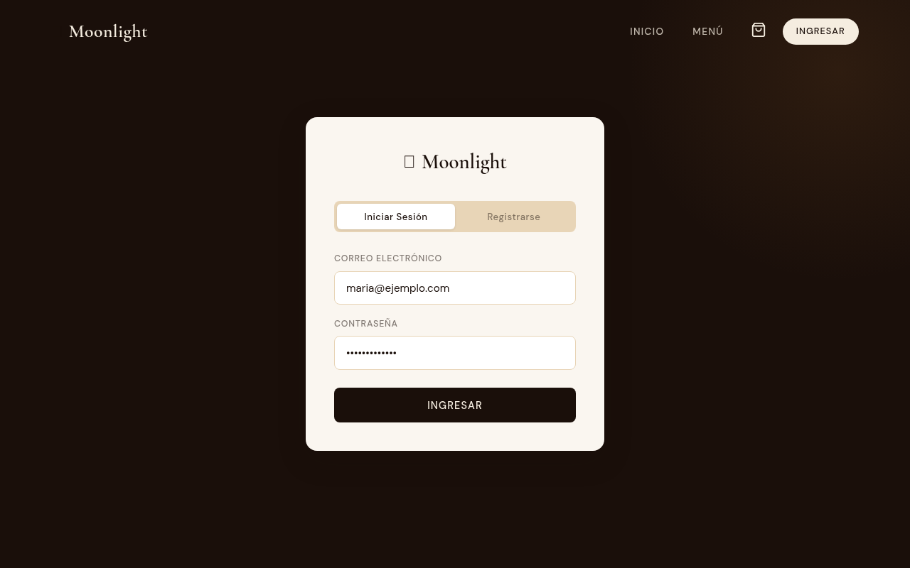

Si las credenciales son correctas, serás redirigido a la página anterior o a la página de inicio.

### 6.2 Registrarse

Si no tienes cuenta, haz clic en la pestaña **"Registrarse"** dentro del mismo formulario.

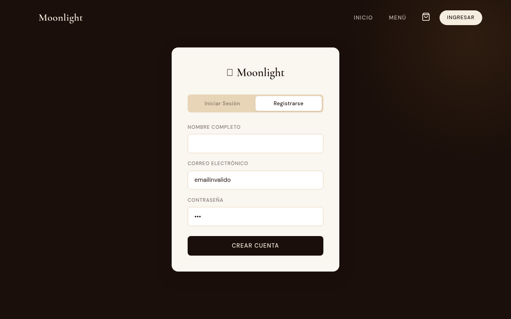

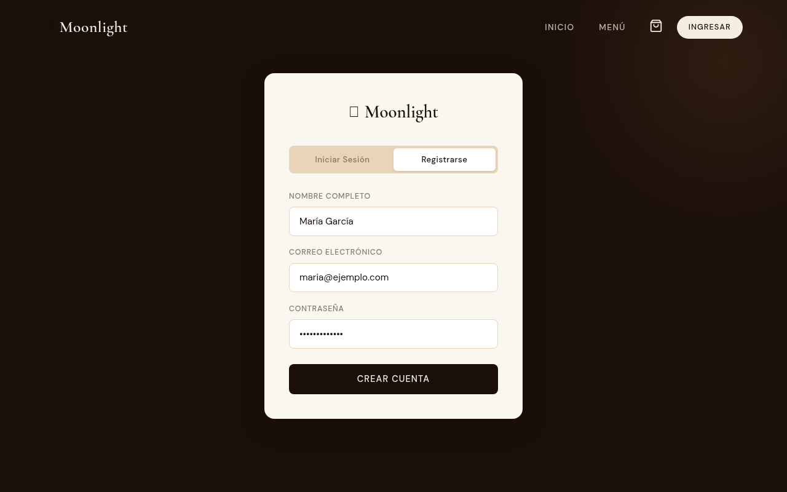

**Campos requeridos:**

| Campo | Descripción |
|---|---|
| **Nombre completo** | Tu nombre tal como deseas que aparezca en la cuenta |
| **Correo electrónico** | Debe ser una dirección válida (p. ej., `usuario@gmail.com`) |
| **Contraseña** | Mínimo **8 caracteres** |

Haz clic en **"Crear Cuenta"** para finalizar el registro. Serás autenticado automáticamente.

### 6.3 Errores de validación

Si hay datos incorrectos, el formulario muestra mensajes de error debajo de cada campo:

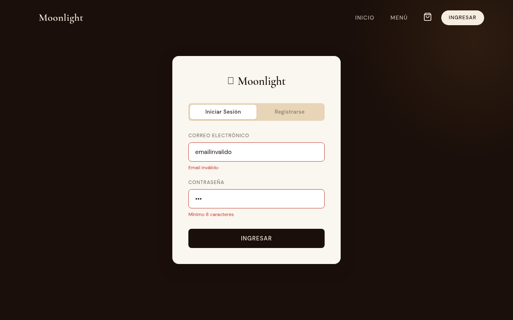

| Error | Causa |
|---|---|
| *"Email inválido"* | El correo no tiene el formato correcto |
| *"Mínimo 8 caracteres"* | La contraseña es demasiado corta |
| *"El nombre es requerido"* | Dejaste el campo de nombre en blanco (al registrarse) |

Corrige los campos marcados y vuelve a intentarlo.

### 6.4 Menú de usuario (sesión activa)

Con sesión iniciada, el botón **"Ingresar"** es reemplazado por un **avatar con tus iniciales**. Al pasar el cursor o hacer clic sobre él aparece un menú desplegable:

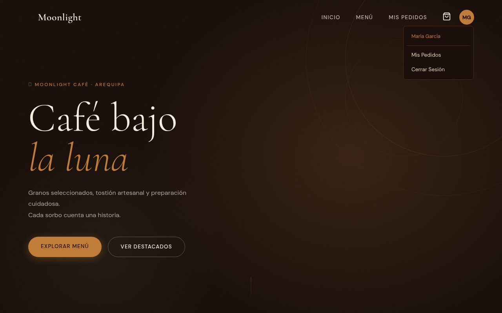

| Opción | Acción |
|---|---|
| *Nombre completo* | Información del usuario activo (solo lectura) |
| **Mis Pedidos** | Navega al historial de pedidos |
| **Cerrar Sesión** | Cierra la sesión y regresa al inicio |

### 6.5 Cerrar Sesión

Haz clic en **"Cerrar Sesión"** dentro del menú desplegable del avatar. Tu sesión finaliza y eres redirigido a la página de inicio.

---

## 7. Carrito de Compras

El carrito es el panel lateral donde gestionas tu pedido antes de confirmarlo.

### 7.1 Abrir el carrito

Haz clic en el **ícono de bolsa de compras** en la barra de navegación superior derecha.

Cuando tienes productos en el carrito, aparece un **badge naranja** con el número de artículos.

El carrito se abre también automáticamente cada vez que agregas un producto desde el catálogo.

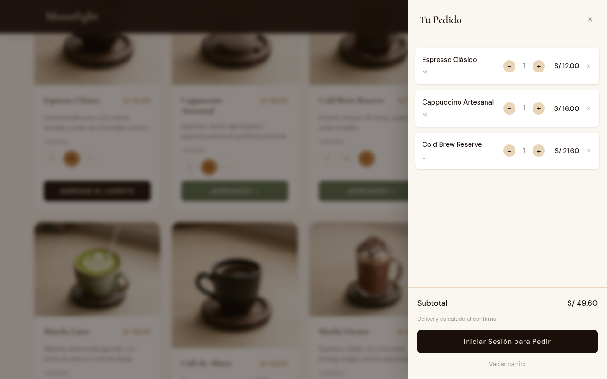

Cada línea del carrito muestra:
- **Nombre** del producto
- **Tamaño** (S, M o L)
- **Controles de cantidad** (− y +)
- **Precio** total de esa línea
- **Botón ✕** para eliminar el artículo

Al pie del carrito se muestra el **subtotal** y el botón para confirmar el pedido.

### 7.2 Modificar cantidades

Usa los botones **−** y **+** junto a cada producto para ajustar la cantidad.

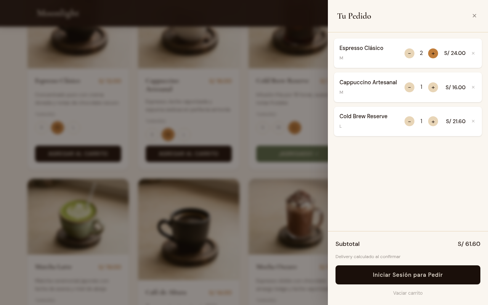

- El mínimo es **1** unidad.
- El máximo es **20** unidades por artículo.
- El subtotal se actualiza inmediatamente.

> Si reduces la cantidad a 0 pulsando **−**, el producto se elimina automáticamente del carrito.

### 7.3 Eliminar productos

Haz clic en el botón **✕** a la derecha de cualquier producto para eliminarlo del pedido.

### 7.4 Vaciar el carrito

El botón **"Vaciar carrito"** (al pie del panel) elimina todos los productos de una sola vez.

Tras vaciarlo, verás la pantalla de carrito vacío:

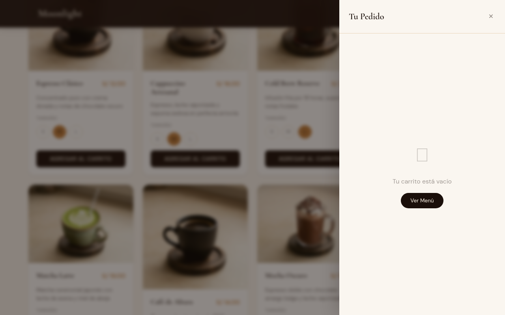

Desde aquí puedes hacer clic en **"Ver Menú"** para volver al catálogo.

### 7.5 Confirmar pedido

- **Si tienes sesión iniciada:** aparece el botón **"Confirmar Pedido"** (fondo oscuro).  
  Haz clic para enviar tu pedido. El carrito se vacía y aparece una notificación de confirmación.

- **Si no tienes sesión:** el botón muestra **"Iniciar Sesión para Pedir"**.

  Al hacer clic serás redirigido al formulario de login; una vez autenticado podrás completar el pedido.

### 7.6 Carrito vacío

Si intentas abrir el carrito sin haber agregado nada, verás la pantalla vacía con el ícono 🌙 y la opción de ir al menú.

---

## 8. Mis Pedidos

Esta sección muestra el historial completo de pedidos realizados con tu cuenta.

> **Requiere sesión activa.** Si no has iniciado sesión, serás redirigido automáticamente al formulario de login.

Accede desde la barra de navegación (**Mis Pedidos**) o desde el menú desplegable del avatar.

### 8.1 Ver historial de pedidos

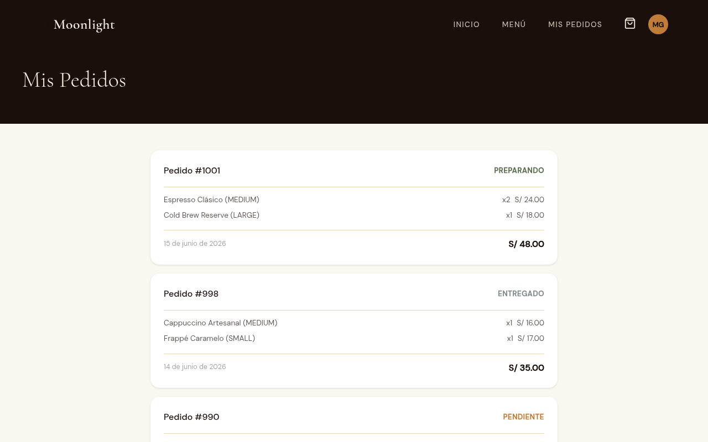

Cada tarjeta de pedido contiene:

| Dato | Descripción |
|---|---|
| **Pedido #XXXX** | Número único de identificación |
| **Estado** | Situación actual del pedido (ver tabla abajo) |
| **Productos** | Lista de bebidas, tamaño, cantidad y precio parcial |
| **Fecha** | Día en que se realizó el pedido |
| **Total** | Importe total del pedido |

### 8.2 Estados de un pedido

| Estado | Color | Significado |
|---|---|---|
| **Pendiente** | 🟠 Ámbar | El pedido fue recibido y está en cola |
| **Preparando** | 🟢 Verde oliva | El barista está preparando las bebidas |
| **Listo** | 🟢 Verde | El pedido está listo para recoger o entregar |
| **Entregado** | ⚪ Gris | El pedido fue entregado correctamente |
| **Cancelado** | 🔴 Rojo | El pedido fue cancelado |

---

## 9. Notificaciones (Toast)

La aplicación muestra notificaciones emergentes en la esquina de la pantalla para informar sobre acciones importantes.

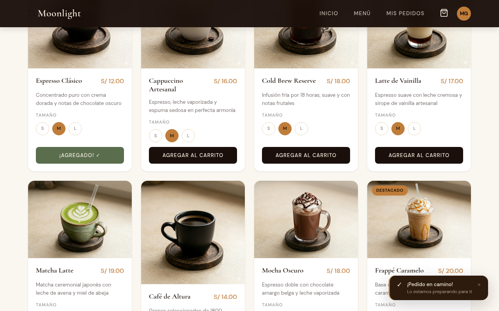

| Notificación | Cuándo aparece |
|---|---|
| **"¡Pedido en camino!"** | Al confirmar un pedido exitosamente |
| **"Ya está en tu pedido"** | Al agregar un producto que ya existe en el carrito |

Las notificaciones desaparecen automáticamente tras **~4 segundos**, o puedes cerrarlas manualmente con el botón **✕**.

---

## 10. Página no encontrada (404)

Si ingresas una dirección URL incorrecta o un enlace roto, verás la siguiente pantalla:

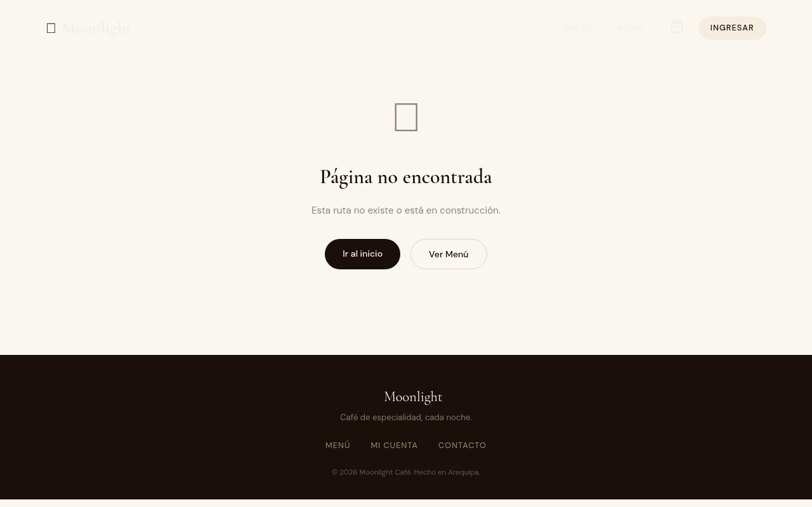

Usa los botones de la barra de navegación para volver al **Inicio** o al **Menú**.

---

## 11. Navegación general (Navbar)

La barra de navegación superior está presente en todas las páginas de la aplicación.

| Elemento | Visible sin sesión | Visible con sesión |
|---|:---:|:---:|
| Logo 🌙 **Moonlight** (enlace a inicio) | ✅ | ✅ |
| **Inicio** | ✅ | ✅ |
| **Menú** | ✅ | ✅ |
| **Mis Pedidos** | — | ✅ |
| Ícono del carrito (con badge) | ✅ | ✅ |
| Botón **"Ingresar"** | ✅ | — |
| Avatar con iniciales + dropdown | — | ✅ |
| Menú hamburguesa (móvil) | ✅ | ✅ |

> **Comportamiento al hacer scroll:** La barra de navegación cambia de estilo (fondo más opaco) cuando el usuario baja en la página, para mantener visibilidad.

> **Dispositivos móviles:** En pantallas pequeñas los enlaces de navegación se agrupan en un **menú hamburguesa** (≡) que se despliega al tocar.

---

## 12. Preguntas Frecuentes (FAQ)

**¿Puedo ver el menú sin crear una cuenta?**  
Sí. El catálogo y los filtros están disponibles para cualquier visitante. Solo necesitas cuenta para confirmar pedidos.

**¿Puedo agregar el mismo producto en tamaños distintos?**  
Sí. Cada combinación de producto + tamaño ocupa una línea independiente en el carrito. Por ejemplo, puedes tener un Espresso M y un Espresso L al mismo tiempo.

**¿Cuánto cuesta el delivery?**  
El costo de delivery se calcula y muestra al momento de confirmar el pedido (aún no visible en el subtotal del carrito, solo se indica "Delivery calculado al confirmar").

**Olvidé mi contraseña, ¿qué hago?**  
Actualmente la recuperación de contraseña no está disponible en la aplicación web. Contacta al equipo en moonlight@gmail.com.pe para recibir asistencia.

**¿Puedo cancelar un pedido?**  
No desde la aplicación. Una vez confirmado, el pedido entra en preparación. Para cancelaciones urgentes comunícate directamente con la cafetería.

**¿La aplicación funciona en mi teléfono?**  
Sí. Moonlight Café es completamente responsive y funciona en cualquier smartphone con navegador moderno.

**¿Por qué no veo productos en el catálogo?**  
Es posible que el servidor no esté disponible temporalmente. Recarga la página y si el problema persiste, escribe a moonlight@gmail.com.pe.

---

**🌙 Moonlight Café · Arequipa, Perú**  
moonlight@gmail.com.pe  

*Manual elaborado para la versión 1.0 de la plataforma web.*

